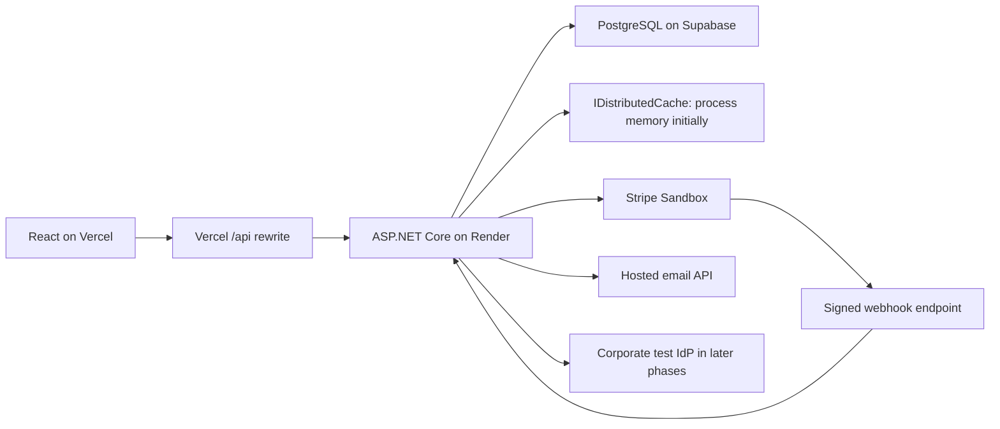

# Subscription Lab — Implementation Plan

Version: 1.0  
Prepared: 2026-10-01  
Status: planning baseline (living document); implementation progress is tracked in backlog.md  
Companion: [Implementation backlog](backlog.md)

## 1. Purpose and working agreement

Build a small SaaS learning application with a C# API, React frontend, personal Free/Pro/Max subscriptions, and an additional Enterprise organization experience. The objective is to understand identity, authorization, commercial entitlements, billing, data isolation, and their failure modes by implementing and testing them progressively.

A person can register, use Free, purchase Pro or Max, and use the product alone. They never need to create an organization. Enterprise is a separate account context with shared data, licensed members, negotiated terms, corporate login, and provisioning. A user can have both a personal subscription and memberships in organizations.

Implementation takes place in a later session. Read this file, the backlog index (backlog.md), and the relevant per-phase file under backlog/ before changing code; CLAUDE.md at the repo root carries the condensed working agreement. Start with P00 and follow the phase sequence. External verification may remain pending while useful local work continues, as explained in section 11. Do not introduce sessions, refresh-token cookies, Redis, or ASP.NET Core Identity into the first JWT lesson merely because they appear in later phases.

All source code, identifiers, database names, migrations, comments, tests, logs, error codes, and technical documentation are in English. Explanations to the user remain in Spanish. The dummy UI will use English text initially; localization is outside this learning scope.

The backlog is the implementation tracker. This plan defines the architecture, policies, sequence, and completion gates. Update both when a decision changes. A planned item is not an implemented feature.

## 2. Decisions and scope boundaries

| ID | Decision | Status |
|---|---|---|
| D01 | ASP.NET Core on .NET 10 LTS; EF Core and Npgsql for PostgreSQL | Baseline |
| D02 | React with TypeScript; Vite for the small frontend | React confirmed; tooling baseline |
| D03 | PostgreSQL locally; Supabase PostgreSQL for the hosted test environment | Confirmed |
| D04 | React deployed to Vercel; API deployed to Render through a Dockerfile | Confirmed |
| D05 | Own identity tables and application flows first; maintained cryptographic/JWT libraries | Confirmed |
| D06 | Begin with short-lived bearer JWTs, no server session table or refresh flow | Confirmed learning sequence |
| D07 | Add persisted sessions, then refresh tokens, then secure browser-cookie transport | Confirmed learning sequence |
| D08 | Compare and migrate to ASP.NET Core Identity later, preserving the user experience | Confirmed backlog requirement |
| D09 | Stripe Sandbox plus a deterministic local billing simulator | Confirmed |
| D10 | Mailpit locally; MailDev is an interchangeable SMTP capture alternative | Baseline |
| D11 | Hosted email through an external HTTPS email API; Resend is the initial candidate | Provider selected during deployment setup |
| D12 | Start entitlement reads from PostgreSQL; add IDistributedCache with AddDistributedMemoryCache | Confirmed |
| D13 | Initial Render deployment uses process-local memory cache and one API instance | Confirmed |
| D14 | Add local Redis as a later exercise; hosted Redis is optional | Confirmed progression |
| D15 | Product logic and authorization reside in the C# API; Supabase is used as PostgreSQL | Confirmed |
| D16 | Corporate OIDC through a local test identity provider and a C# SCIM endpoint are required | Baseline for complete Enterprise lab |
| D17 | Live Entra interoperability, SAML, hosted multi-instance Redis, and real-money launch are separately tracked extensions | Conditional/optional scope |
| D18 | Create an English Markdown backlog with acceptance criteria, dependencies, and test evidence | Delivered by backlog.md |
| D19 | .NET Aspire AppHost is the single local orchestrator (API, Vite frontend, PostgreSQL, and later Mailpit/Redis/IdP containers); hosted deployments do not use Aspire. See [ADR 0002](decisions/0002-solution-layout-and-aspire-orchestration.md) | Baseline |
| D20 | Migrations are applied by a separate Migrator step (never on API startup); tables live in the default `public` schema and one database login serves migrations and the API for now; custom schemas and separate migration/runtime roles are deferred (hosted database, DEP-01). See [ADR 0003](decisions/0003-postgresql-migrations-and-database-layout.md) | Baseline |

No blocking product question remains. Credentials, actual resource names, a verified email domain, and provider account access are setup inputs, not reasons to defer the local implementation. They must be supplied through secure configuration when the relevant phase begins, never pasted into tracked files.

### What the dummy product does

Users create, list, edit, archive, and delete projects. Paid accounts can generate simple reports over their own projects. A basic report is a CSV download. An advanced report adds aggregate statistics to a simple report result. PDF generation, rich report design, and a complex product domain are not required.

The product also includes a subscription page, usage display, billing actions, account switching, organization administration, security settings, and a restricted operator area for Enterprise setup and troubleshooting. Public marketing content, mobile clients, marketplaces, and microservices are out of scope.

### Baseline lab values

These are invented, editable test fixtures, not real commercial offers. Store them in versioned configuration/seeds and expose them clearly as sandbox data.

| Setting | Baseline |
|---|---|
| Free | Personal account; 3 active projects; no report generation; no card required |
| Pro | Personal account; 30 active projects; basic reports; 100 successful reports per quota period |
| Max | Personal account; 300 active projects; basic and advanced reports; 1,000 successful reports per quota period |
| Enterprise fixture | Organization; 10 licensed seats; 500 active projects; 2,000 reports per quota period; basic/advanced reports; SSO and SCIM |
| Personal sandbox prices | USD 10/month Pro, USD 30/month Max; annual fixtures added later at USD 100 and USD 300 |
| Enterprise sandbox price | USD 200/month for the fixed 10-seat fixture; invoice due in 30 days; no automatic per-seat overage |
| Personal renewal grace | 3 days after a confirmed renewal failure, ending at an explicit access deadline |
| Enterprise overdue grace | 7 days after invoice due date; configurable by contract |
| JWT lifetime | 10 minutes; short configured clock tolerance, initially 30 seconds |
| Later session lifetime | 30-day absolute maximum; 7-day inactivity expiry; no indefinite renewal |
| Verification/reset/invitation expiry | 24 hours / 30 minutes / 7 days; all single-use |
| Entitlement cache | Maximum 30 seconds absolute lifetime, shortened by the next access transition |
| Report retention | 24 hours for temporary report results; reauthorization required to download |
| Terminated organization data | 30-day lab retention after termination; explicit purge workflow, no immediate subscription-driven deletion |

Monthly subscriptions use the billing period as the report quota period. Annual subscriptions still receive monthly quotas anchored to the original activation day. Month-end anchors clamp to the last day and recover the original anchor in subsequent months. Use UTC half-open intervals [start, end). Upgrades change the limit of the existing quota period without resetting usage. A downgrade applies at its effective boundary. Free has no report quota to renew. Enterprise quota windows follow the contract anchor, independently of invoice payment dates.

## 3. Concepts and architectural shape

| Concept | Meaning |
|---|---|
| User | A person and their local identity |
| Account | Ownership and billing boundary, either Personal or Organization |
| Membership | User access, role assignments, and status within an account |
| Permission | An allowed operation, such as projects.write or billing.manage |
| Plan version | An immutable commercial package once referenced by subscriptions |
| Entitlement | An effective capability or limit for an account at a specific time |
| Subscription | Commercial lifecycle and association with a plan/price |
| Usage | Consumption within a defined quota window |
| Session | Later server-side record controlling a login independently of its access token |
| Feature flag | A deployment/learning configuration switch, separate from purchased capabilities |

The JWT identifies the caller. Membership and resource ownership establish the account boundary. Permissions authorize the action. Effective entitlements and quota policies decide whether the account can use a paid function now. These checks compose; none replaces the others.

Use a modular monolith with one API deployment and one relational database. Keep modules for Identity, Accounts, Authorization, Subscriptions, Billing, Usage, Projects/Reports, and Audit. Keep provider-specific code at integration boundaries. Do not require an event broker, CQRS framework, generic repository layer, or microservice split.

Suggested repository layout (created during implementation):

    Saas.Subscription.Sample.slnx
    src/backend/Saas.Subscription.Sample.Domain/
    src/backend/Saas.Subscription.Sample.Application/
    src/backend/Saas.Subscription.Sample.Infrastructure/   (all provider integrations: persistence, email, billing, cache, ...)
    src/backend/Saas.Subscription.Sample.Migrator/         (applies EF migrations; never part of the API)
    src/backend/Saas.Subscription.Sample.Api/
    src/frontend/
    src/aspire/Saas.Subscription.Sample.AppHost/           (local orchestration only)
    tests/unit/
    tests/integration/
    tests/browser/
    CLAUDE.md
    docs/plan.md
    docs/backlog.md            (index)
    docs/backlog/              (one file per phase: P00…P12, optional)
    docs/decisions/
    docs/runbooks/

Layer references are one-directional: Domain depends on nothing, Application on Domain, Infrastructure on Application, Api composes Application and Infrastructure, and the Migrator depends on Infrastructure only. Interfaces (seams) live in Application; their provider implementations live in Infrastructure, one folder per integration. Modules (Identity, Accounts, Billing, ...) are folders inside each layer, not separate projects. An automated check of the declared project references is deferred to FIN-04.

Useful integration seams are IBillingGateway, IEmailSender, a password-hashing abstraction, and an account entitlement service. Use .NET TimeProvider for business time and tests. Keep authorization policies and use-case validation centralized instead of scattering plan-name comparisons through controllers.

Proxying is a browser integration choice, not an authorization boundary. Direct requests to Render must receive the same authorization checks. Stripe webhooks target Render directly and use signature verification, not browser cookies. Local React uses a development proxy to the local API.

## 4. Data model and invariants

Use UUID identifiers, UTC timestamps, decimal monetary amounts with currency, explicit concurrency control, and migration-managed schemas. Use English snake_case database identifiers. Keep stable user and account IDs through the Identity comparison. Keep application tables apart from Supabase-managed schemas (`auth`, `storage`, ...): the lab uses the default `public` schema with the exposure caveat in §10.

| Module | Core tables and key information |
|---|---|
| Identity, first lesson | users; password_credentials with algorithm/version/parameters and encoded hash |
| Identity, later lessons | email_verification_tokens; password_reset_tokens; sessions; refresh_tokens; mfa_credentials; recovery_codes; external_identities |
| Accounts | accounts with type/status; memberships; roles; permissions; role_permissions; membership_roles; invitations |
| Catalog | plans; plan_versions; plan_prices; feature_definitions; plan_capabilities |
| Subscription state | subscriptions; subscription_changes with effective_at; effective access projection/version; billing_customers |
| Enterprise | enterprise_contracts and revisions; contract_capabilities; seat_assignments; identity_connections; provisioning_connections; external_group_mappings |
| Usage/product | projects; reports; usage_counters; usage_reservations with idempotency keys |
| Integrations/operations | webhook_inbox; outbox_messages; operation_idempotency; audit_events; reconciliation_runs |

Key invariants:

1. One personal account per user. Registration creates the user, personal account, and owner membership atomically. Free is a local default, not a required Stripe subscription.
2. Organization membership is independent of personal subscription. Removing membership never deletes the global user or their other accounts.
3. Business resources carry account_id. Lookups, updates, foreign-key relationships, files, report downloads, cache keys, and delayed jobs must retain the verified account boundary.
4. User-supplied account IDs are selectors only. Membership is checked server-side. Set account ownership fields from trusted context, not request payloads.
5. Membership roles are account-scoped. Platform operator roles are a separate privileged scope. Pro and Max are never identity roles.
6. Keep at most one effective base commercial subscription per account. Prevent concurrent checkout attempts from creating two subscriptions. Historical and pending records remain available.
7. Separate plan capabilities from prices and provider IDs. Monthly and annual prices can reference the same capability package.
8. Published plan versions and accepted contract revisions are immutable. Changes create revisions with explicit effective dates.
9. External identities are unique by trusted issuer/provider and subject. Matching an email address alone does not link accounts or grant organization membership.
10. Invitation, verification, reset, and refresh secrets are random and only their hashes are stored. Passwords use an appropriate password hash. MFA shared secrets require encryption because they must be recovered for verification; recovery codes are hashed.
11. Billing-customer and provider-subscription mappings are account-scoped. Portal sessions are created only after billing authorization for that exact account.
12. Quota reservation and mutation are transactional and idempotent. A report retry cannot count twice. Release a reservation on terminal generation failure; count successful reports once. Recover abandoned reservations after restart.
13. Idempotency records are scoped by account and operation, compare request fingerprints, and reject key reuse for a different payload.
14. Audit events identify the actor, account, action, result, timestamp, and correlation ID. Exclude passwords, raw tokens, signing keys, connection strings, and full payment details.

EF query filters are useful defaults but do not replace write checks, scoped resource authorization, or cross-account tests. Raw SQL and maintenance jobs must obey the same boundaries. PostgreSQL RLS is an optional additional layer and must not be assumed to understand a JWT validated only by the C# API.

## 5. Authentication progression

### A. JWT essentials — P01

Implement own registration/login services and credential persistence. Use a maintained Argon2id implementation selected and pinned during implementation, or document an equivalent reviewed password-hashing choice. Calibrate a security-appropriate work factor. Persist the format/version to enable later migration. Use constant-time library verification and secure random generation.

Issue signed access JWTs through a maintained token library; prefer asymmetric signing with a persistent configured key and key ID. Validate allowed algorithms, signature, issuer, audience, expiry, and not-before. Require subject and token ID. Do not regenerate the signing key on each Render startup. Reject unsigned tokens and tokens intended for another API.

React holds the access token in memory and sends it as a bearer token. Reload or expiry requires login again. Local logout discards the client token; an already-issued copy remains usable until expiry. No session row, refresh token, auth cookie, or claim of immediate JWT revocation exists at this checkpoint. Basic login throttling, generic credential errors, protected routes, and secret handling are still required.

The application's custom login/token flow is a learning implementation, not a general OAuth/OIDC authorization server. Corporate login later uses standards middleware against an actual IdP.

### B. Permissions and entitlements — P02

JWT subject identifies the caller; resolve current membership and account access in the backend. Token claims do not permanently encode subscription rights. An upgrade does not require re-login. Reuse a request-local access snapshot where safe, but enforce quota mutation atomically. Historical copies of roles or plan labels must not override current server policy.

### C. Identity lifecycle and sessions — P06

Add verified email, reset flows, protected email changes, session listing, current/all-session revocation, account disable, and MFA. Define how existing P01 tokens expire during the transition rather than silently accepting both authorization models forever. New JWTs include a session identifier; session-aware endpoints verify the current session and user security version. Revoke affected sessions on password reset and security-sensitive changes. Session revocation is authoritative in PostgreSQL initially.

Verification gates must still allow recovery and resend-verification operations. Never expose a verification/reset secret as a convenience API response in a hosted environment.

### D. Refresh tokens, then cookie transport — P07

First implement and test the server-side opaque refresh-token lifecycle: hashing, one-time rotation, absolute and inactivity limits, family relationships, and replay handling. Rotation is atomic. A repeated invalid old token must not silently create another valid branch. Test normal concurrent browser behavior and define retry policy so a lost response does not cause uncontrolled token-family churn.

Then integrate React with a host-only Secure, HttpOnly refresh cookie through the Vercel /api proxy. Keep the access JWT in memory. Cookie lifetime cannot extend the server-side session lifetime. Add CSRF protection and exact trusted-origin validation to cookie-authenticated mutations, including refresh/logout as applicable. Cookie security requires browser tests; CORS is not CSRF protection.

Never cache authentication responses on the CDN. Verify Set-Cookie, cookie path/domain, forwarding headers, callback URLs, and HTTPS behavior through the real proxy. Default hosting domains must not depend on unrestricted third-party-cookie support.

### E. Identity comparison — P11

The planning marker AUTH-COMPARE maps to backlog items CMP-01 through CMP-04. It tracks a later implementation/comparison exercise, not a switch that disables authentication.

Implement an ASP.NET Core Identity-backed variation behind the existing application seams. Keep users/account ownership stable, preserve the existing JWT contract where practical, and rerun the same behavior/security suite. Identity replaces selected user-management work; it does not implement our billing, account memberships, entitlements, quota engine, or automatically provide a full OAuth server.

Provide a staged hash migration or custom verifier for old hashes with rehash-on-success. Never attempt to decrypt password hashes. Include session cutover, rollback constraints, and operator recovery. Benchmark equivalent work factors, data, environment, and workloads. Measure login/refresh latency, database queries, allocations, and CPU; report actual results without assuming Identity is faster.

Reference constraints: [JWT validation](https://learn.microsoft.com/en-us/aspnet/core/security/authentication/configure-jwt-bearer-authentication?view=aspnetcore-10.0), [password storage](https://cheatsheetseries.owasp.org/cheatsheets/Password_Storage_Cheat_Sheet.html), and [Identity customization](https://learn.microsoft.com/en-us/aspnet/core/security/authentication/customize-identity-model?view=aspnetcore-10.0).

## 6. Authorization, capabilities, and cache consistency

Evaluate account-scoped access as: valid authentication, active account/membership, required authentication assurance, permission, resource ownership, effective entitlement, and available quota when applicable. A corporate SSO requirement is account security policy, not a global restriction on personal login.

Examples of permissions: projects.read, projects.write, reports.generate, members.manage, billing.manage, security.manage, and audit.read. Examples of capabilities: reports.basic, reports.advanced, projects.max_count, reports.monthly_limit, and seats.max_count. Capability absence denies the capability. Numeric limits have explicit semantics; unlimited must be represented intentionally rather than using an arbitrary large number.

Personal owners receive appropriate account permissions automatically. For organizations, use Owner, Admin, BillingAdmin, and Member roles with an explicit permission matrix. BillingAdmin manages billing but does not automatically read project content. Admin cannot transfer ownership or assign platform privileges. Prevent removal of the final active owner; ownership transfer is a protected, audited transaction.

Initial entitlement resolution reads PostgreSQL. The later cache layer uses IDistributedCache and AddDistributedMemoryCache in local and single-instance hosted environments. Cache keys include environment, schema/version namespace, and account ID. Resolve a snapshot with calculated_at, access_version, effective_from, and valid_until. Catalog versioning and account access versioning are different concepts.

The memory provider is process-local despite the interface name. Restarting it may lose every entry safely. Redis later changes the provider registration, not domain decisions. IDistributedCache does not supply atomic quota increments, compare-and-swap, pub/sub, or a reliable queue. Keep quota mutations in PostgreSQL. [Microsoft cache provider documentation](https://learn.microsoft.com/en-us/aspnet/core/performance/caching/distributed?view=aspnetcore-10.0).

### Change processing

1. Validate and deduplicate the authoritative billing or operator event.
2. Persist the revised subscription/contract and access_version in a PostgreSQL transaction.
3. Add an outbox invalidation record in the same transaction.
4. Commit, then evict/update the account cache and notify/refetch frontend state.
5. Retry undelivered outbox work after failures; use a bounded absolute cache expiry as a safety limit.

Writing the database and an external cache is not one atomic transaction. Avoid stale refill races through version-aware publication and per-account synchronization; a versioned key alone is insufficient if the version pointer can be stale. Prove the implementation under concurrent reads and invalidation. Revalidate after acquiring any synchronization boundary and prevent an older snapshot replacing a newer one. A version check against PostgreSQL is acceptable in the learning implementation.

### Explicit consistency contract

Cached noncritical capability displays/read paths may lag an unexpected change by at most 30 seconds while invalidation recovers. Known effective dates shorten validity to that exact boundary. The resolver evaluates persisted schedules and current time even if a worker has slept. Never extend a snapshot beyond its access-validity deadline through sliding expiration or a failed refresh.

Security-sensitive membership/session changes, billing mutations, seat allocations, and quota-consuming writes use authoritative database checks. For report creation, verify the effective limit and reserve usage within the same serialized account/usage transaction. Do not advertise immediate revocation based solely on best-effort cache eviction. If neither the database nor a policy-acceptable unexpired snapshot is available, return a recoverable service error rather than granting uncertain access.

On multi-instance deployment, all caches must share invalidation/version semantics. Process-local eviction on one server cannot invalidate another. Hosted multi-instance operation is gated by the optional shared-cache exercise and its tests.

## 7. Personal subscriptions and billing

### Sources of authority

Stripe owns provider payment/invoice state for Stripe-backed transactions. Our application owns account membership, authorization, commercial mapping, contract metadata, usage, and the rules translating provider state into effective access. Persist provider state and the local access decision separately. Do not equate provider subscription status active with every invoice being paid.

Maintain a local subscription projection for request-time decisions. Ordinary API requests never call Stripe to determine whether a feature is allowed. Preserve a bounded access-validity deadline so provider outages cannot silently extend paid access forever. Reconciliation repairs missed or inconsistent provider events.

### Purchase flow

The authenticated owner chooses a catalog price key. The API resolves the allowed server-side price/provider mapping, verifies account ownership, and creates an idempotent checkout operation. Never accept an arbitrary amount, provider customer ID, or privileged plan assignment from React. Link the Checkout session to the account through server-created references.

Use hosted Stripe Checkout in a general Sandbox. No real card data is stored or handled by our API. The return URL displays pending/confirmed status from our backend; redirect success is not proof of payment. Handle abandoned sessions, delayed confirmation, authentication-required payments, duplicate browser submissions, and users who never return from Checkout.

Create customer portal sessions only for the authorized account. Use the portal primarily for payment-method updates and invoice access. Route plan changes/cancellation through our own endpoints unless the portal configuration is proven to enforce exactly the same policies. The Enterprise fixture does not offer unrestricted self-service contract cancellation.

### Personal lifecycle policies

| Event | Effective behavior |
|---|---|
| Registration | Free capabilities; no external customer needed until billing is used |
| Initial paid purchase incomplete | Keep Free; show an actionable pending/payment-required state |
| Paid activation | Apply purchased capabilities after authoritative confirmation |
| Pro to Max | Preview proration; collect required amount; keep current rights if payment fails; apply confirmed upgrade |
| Max to Pro | Schedule for current paid period end; show current and next plan separately |
| Cancel renewal | Keep current paid access until paid-through date, then revert to Free |
| Undo scheduled cancellation/change | Cancel the pending transition idempotently if still allowed; retain history |
| Renewal succeeds | Advance paid-through and period state; never double-grant usage for repeated events |
| Renewal fails | Apply the configured 3-day grace after the confirmed failure; retain billing recovery access |
| Grace expires | Restrict paid features; preserve data; keep account/recovery/billing operations available |
| Payment recovers | Restore access from current confirmed provider state; prevent accidental second subscription |
| Existing resources exceed new cap | Preserve data; allow deletion/archive and appropriate read access; reject new creations above cap |
| Partial refund | Record it; access unchanged by default |
| Full refund or dispute | Create an operator-review case; keep existing access policy until an audited operator decision; no implicit data deletion |

Refund/dispute fixtures demonstrate accounting/access separation. Their operational policy is a lab choice, not a complete real-money fraud policy. Switching monthly/annual cadence occurs at a scheduled boundary in this lab; show the future price/date and preserve the documented quota anchor.

For paid upgrades, verify the Stripe API version and supported pending-update flow. Applying a provider plan update before payment succeeds can incorrectly grant service. [Stripe pending updates](https://docs.stripe.com/billing/subscriptions/pending-updates).

### Webhook inbox, work processing, and reconciliation

Verify the signature and timestamp against the exact raw request body with the official SDK. Check the configured environment/account context. Store a durable inbox record before responding successfully; never acknowledge work held only in memory. Minimize and protect retained event payloads. Unique event IDs deduplicate deliveries; operation-level guards also handle distinct events for the same business change.

Process inbox/outbox rows with leases, bounded retries, backoff, and a failed-work state. A BackgroundService may poll PostgreSQL in the single-instance lab. Workers must resume after a crash. Long external calls should not hold open database transactions. Serialize/guard updates per subscription or account and reconcile against current provider objects when event ordering is uncertain. Event creation timestamps alone are not an ordering guarantee.

Provide a protected operator action to inspect/retry/reconcile selected records. A reconciliation job compares provider subscriptions/invoices to local mappings, records discrepancies, and applies the same idempotent processing path. Public endpoints cannot inject simulated billing events. [Stripe webhook behavior](https://docs.stripe.com/webhooks).

### Simulator and time

IBillingGateway has a deterministic local simulator and a Stripe adapter. The simulator can produce success, failure, duplicate delivery, delayed delivery, out-of-order delivery, timeouts, and eventual recovery. Scenario controls are test-only and unavailable in hosted release configuration.

Stripe Test Clocks exercise supported Billing lifecycle scenarios. They do not move the .NET clock; align fixtures through TimeProvider and explicit effective timestamps. Keep Checkout tests and API-created time simulations separate where provider restrictions require it. Test quota boundaries with a fake application clock as well as provider events. [Stripe billing simulations](https://docs.stripe.com/billing/testing/test-clocks).

## 8. Enterprise account lifecycle

### Organization and seat model

Organizations have separate projects, reports, usage, billing mappings, members, and security policy. Personal account data remains separate. Any future transfer of personal content into an organization requires an explicit, authorized transfer feature; it is outside this scope.

Invitations target a verified recipient, expire, and are single-use. Corporate domain verification supports discovery/routing but never grants membership by itself. Accepting an invitation checks identity, invitation state, account state, and seat availability in one transaction.

A licensed active member consumes one seat. Pending invitations and provisioned-but-unlicensed users consume none. When all seats are assigned, membership may remain pending/unlicensed but product access is denied with a clear reason. No background process silently buys more seats. Billing/security-only access may be granted to an owner or BillingAdmin without a product license; this exception never grants project/report access.

Seat reassignment, offboarding, and contract capacity changes are audited. Reject capacity reductions below currently assigned seats unless accompanied by an explicit reassignment/removal plan. Suspension/offboarding removes access before asynchronous cleanup. Preserve organization-owned content and allow owner reassignment of responsibilities.

### Contract and invoice model

Track contract revisions, accepted-by/reference, start/end dates, renewal decision, quantity, included capabilities, explicit overrides, price/currency, billing interval, invoice due terms, grace policy, support label, and retention terms. The fixture uses an operator-recorded simulated acceptance, not an e-signature integration or a claim of legal validity.

Only restricted platform operators can publish/activate negotiated contracts. Organization admins cannot edit signed commercial terms. Use audited, versioned overrides with effective dates and precedence: base plan capabilities, then allowlisted contract overrides, then current lifecycle restrictions. Security policy is enforced independently and cannot be disabled by a downgrade override.

Invoice-backed access can begin on the accepted contract start date before the first invoice is paid. Due date and contract access deadline are separate. Generate and track sandbox invoices; use provider-confirmed reconciliation for manual-payment fixtures. [Stripe invoice collection](https://docs.stripe.com/billing/collection-method).

Contract renewal, amendments, nonrenewal, grace, restriction, export, retention, and eventual purge are explicit workflows. Terminated organizations retain only policy-allowed recovery/export/billing access during retention. SSO requirements remain enforced; a billing failure must never turn corporate data into personal-password-accessible data.

### Corporate authentication

Configure an OIDC connection per organization with trusted issuer, client configuration, metadata, and secret/certificate references. Do not construct trusted issuers from arbitrary incoming token claims. Implement discovery and callback handling through maintained middleware, including state, nonce, PKCE where applicable, and exact redirect validation.

Use a local Keycloak test directory to exercise a real OIDC protocol flow. This provider represents the fictional corporation; our application still owns its local identity tables. Bind an external identity to a local user only through a verified linking or invitation flow. Track corporate authentication provenance in the application session. A local-password session or another corporation's SSO cannot satisfy the selected organization's SSO requirement.

On successful corporate login, establish the application's session and refresh cookie through the trusted frontend-origin callback/proxy, then redirect to an allowlisted React route. React obtains its access JWT through the existing refresh flow. Do not place application access or refresh tokens in redirect URLs. Correlation cookies, callback routing, and the final session handoff require browser tests through the same proxy used by the deployment.

Provide a protected owner recovery procedure for misconfigured SSO, with narrowly scoped temporary access, explicit expiry, and audit. Do not create a hidden global SSO bypass. Test connection setup before enforcing SSO.

### SCIM provisioning

Expose an organization-scoped SCIM 2.0 service for Users and the Groups operations needed for role mapping. Support discovery, resource lookup/filtering, pagination, creation, updates, PATCH, and deactivation according to the supported profile. Issue separate rotatable integration credentials scoped to one organization and provisioning permissions.

Provisioning creates/updates membership and licensed/unlicensed state according to contract capacity. Deactivation revokes the organization's membership and associated access, not the global person's personal account. A concurrent SSO login must not reactivate a SCIM-deactivated membership. JIT user creation cannot override explicit provisioning denial. Handle retries and duplicate external IDs idempotently.

A deterministic SCIM test client is mandatory. Real Microsoft Entra validation is a tracked external integration task when a test directory and permissions are available; a local simulator passing is not evidence of Entra certification. Document the delay between external directory changes and receipt by our application. [Microsoft SCIM integration](https://learn.microsoft.com/en-us/entra/identity/app-provisioning/use-scim-to-provision-users-and-groups).

## 9. Frontend and API surface

Use small React pages with explicit loading, empty, error, pending-payment, access-denied, and expired-session states. Display the active account clearly. Do not leak account names/resources from inaccessible accounts. Protect asynchronous state against account switching: a response for account A must not populate account B's UI.

Required screens: register/login; project list/detail; report creation/history; plans; current subscription and usage; checkout return; billing/invoices; later verify/reset/security/sessions/MFA; organization selector; invitations/members/roles/licenses; organization SSO/provisioning settings; audit view; restricted operator contract/reconciliation views.

Capability responses guide UI availability, but the API reauthorizes execution and report download. Refetch capabilities and subscription state after a confirmed change and on account switching. Payment confirmation can use bounded polling; a websocket system is unnecessary.

Endpoint families (exact DTOs are specified in FND-03):

| Family | Representative routes |
|---|---|
| Identity | POST /api/auth/register, /login; GET /api/me |
| Later identity | /api/auth/verify-email, /forgot-password, /reset-password, /refresh, /logout; /api/me/sessions; /api/me/mfa |
| Account context | GET /api/accounts; GET /api/accounts/{accountId}/capabilities and /usage |
| Product | /api/accounts/{accountId}/projects; /reports; /reports/{reportId}/download |
| Catalog and billing | GET /api/plans; /api/accounts/{accountId}/subscription; /checkout; /billing-portal; /plan-change-preview; /plan-changes; /cancel-renewal |
| Provider input | POST /api/webhooks/stripe |
| Organizations | /api/organizations; account-scoped /members, /invitations, /seats, /security, /audit |
| Corporate integration | OIDC challenge/callback endpoints; /scim/v2/... resolved through authenticated integration context |
| Operator | /api/operator/contracts, /billing-events, /reconciliation; explicit platform permission |
| Infrastructure | /health/live; /health/ready; protected or development-only API documentation |

Use ProblemDetails with stable English machine codes. Distinguish unauthenticated 401, denied capability/permission 403, hidden foreign resource 404, business/concurrency conflict 409, throttling 429, and transient dependency failure 503. Do not use HTTP 429 for a contractual monthly quota merely because it is a limit; use a documented quota-exceeded business response. Preserve a correlation ID without exposing exception internals.

Client retries of mutations use idempotency keys where needed. Generate the TypeScript API client or equivalent contract checks from OpenAPI. Never include provider secrets, password hashes, raw reset/refresh tokens, or internal operator-only fields in general DTOs.

## 10. Environments, integrations, and deployment

| Concern | Local development | Hosted testing |
|---|---|---|
| Frontend | React/Vite with /api development proxy | Vercel with explicit API rewrite to Render |
| API | Started by the Aspire AppHost (`dotnet run` on the AppHost), or `dotnet run` on the API alone | Render Docker web service, one instance initially |
| Database | PostgreSQL 17 container with named volume `saas-sample-pgdata`, declared in the AppHost; Migrator runs before the API (FND-02) | Dedicated Supabase test project |
| Cache | Memory; Redis container added in P11 | Memory initially; external Redis only if selected later |
| Billing | Simulator and Stripe Sandbox via CLI forwarding | Separate Stripe Sandbox configuration and public signed webhook |
| Email | Mailpit; MailDev may replace it via SMTP configuration | HTTPS email provider with test recipients/domain |
| Corporate identity | Local test IdP and SCIM test client | Requires a reachable test IdP and callback configuration for hosted SSO demos |
| Files/report results | Temporary storage or bounded database results | Stream small reports or retain bounded results in PostgreSQL; never depend on container disk |

### Local setup and configuration

Pin .NET/EF/provider, Node, package-manager, and container versions when P00 starts. Match the local PostgreSQL major version to the Supabase project's selected version. Keep one checked-in example configuration with placeholders and one documented local startup path: the Aspire AppHost (D19), which is local orchestration only and is never part of the Render image. Never commit a real .env, signing private key, provider API key, or connection string.

Configuration groups: Database, Authentication, Billing, Email, Cache, Frontend, CorporateIdentity, and BackgroundWork. Cache:Provider selects Memory or Redis explicitly; deployment does not automatically mean Redis. Distinguish feature availability for staged lessons from customer entitlements. Startup rejects an unsafe hosted combination such as enabled public billing-simulator endpoints or missing signing keys.

Use environment-specific secrets and provider mappings. Namespace cache entries and webhook/idempotency records by environment/provider account where needed. Do not let Vercel preview deployments operate against the main hosted test database or identity callback configuration by default.

### Supabase

Connect through Npgsql/EF Core with TLS certificate verification. Choose direct connectivity when supported or the session pooler for an IPv4-compatible persistent backend. Size connection pools against the project's connection limits. Review provider behavior before selecting transaction pooling, which has different connection/session semantics. Use a limited runtime database role and a separate migration identity when the hosted database is provisioned (DEP-01); until then the lab uses a single login for both, a deliberate learning simplification (ADR 0003).

Disable the unused Supabase Data API or keep application schemas unexposed with explicit grants. Locally the lab keeps its tables in the default `public` schema (ADR 0003); Supabase exposes `public` through the Data API by default, so disabling the Data API (or revoking `anon`/`authenticated` privileges) is mandatory before the hosted database holds any data (DEP-01). Never expose credential tables through a browser-accessible data endpoint. Our local users do not live in Supabase Auth tables. JWT validation in C# does not automatically populate PostgreSQL auth context. [Connection modes](https://supabase.com/docs/guides/database/connecting-to-postgres), [Data API controls](https://supabase.com/docs/guides/api/securing-your-api).

Apply migrations once per deployment through a controlled CI/operator step, with a database lock and recorded result. Do not assume every Render tier supports predeploy jobs. Avoid uncontrolled concurrent migrations on API startup. Use backward-compatible changes where possible and document rollback limitations before destructive schema changes. Keep sandbox seeds idempotent and separate from schema migrations.

### Render and Vercel

Use a multi-stage API Dockerfile, a non-root runtime where supported, the configured public port bound on 0.0.0.0, and separate liveness/readiness checks. Configure secrets in the host, not in the image. Restart must preserve identity/billing state through PostgreSQL and reload stable signing keys.

Deploy only React to Vercel. Route /api requests to the correct Render API path. Explicitly disable CDN/rewrite caching for authenticated/account-specific responses and auth callbacks; send appropriate no-store headers. Static hashed assets may be cached independently. Configure exact trusted frontend/callback URLs, CORS for any intentional direct cross-origin requests, and only trusted forwarding headers. Test host-only refresh cookies end to end before enabling them. [Vercel rewrites](https://vercel.com/docs/routing/rewrites), [Render Docker](https://render.com/docs/docker).

Render Free can sleep after inactivity, loses process memory on restart, and blocks common outbound SMTP ports. Therefore the lab's in-process worker has no continuous-execution guarantee. Durable inbox/outbox rows resume when the API wakes; access expiry is enforced at request time even if work is late. Do not present the free deployment as an SLA demonstration. [Render Free limitations](https://render.com/docs/free).

### Email and external setup

IEmailSender sends confirmation, password reset, invitation, security-change, and selected billing notifications. Mailpit captures local messages without delivery. For hosted tests use an HTTPS email provider; Resend is the default candidate, with API key and verified sender/domain configuration. A restricted provider test sender can only be used within that provider's permitted recipient rules. If no suitable sender/domain exists yet, mark hosted email acceptance pending rather than pretending capture equals inbox delivery. [Resend .NET integration](https://resend.com/docs/send-with-dotnet).

Deduplicate application notifications and decide which invoice notices Stripe sends to avoid duplicate email. Queue email via the durable outbox once introduced. A transient mail failure must not roll back an already-confirmed subscription or create another user. Rate-limit resends and keep verification/reset endpoints generic enough to avoid account enumeration.

Required setup inputs at the relevant gate: repository/destination, Supabase project/connection, Render service, Vercel project, Stripe Sandbox keys/price mapping/webhook secret, persistent JWT signing material, hosted email sender configuration, and later a corporate IdP connection. Provisioning external resources or spending money is separate from these planning documents.

## 11. Phases, deliverables, and release checkpoints

Within a phase, follow backlog dependency IDs. Every phase includes implementation, relevant tests, a runnable demonstration, and a short English learning note. Estimates should be added after P00 confirms the actual repository and tooling; no calendar commitment is implied.

Dependencies express technical prerequisites and the intended teaching order. If credentials or a reachable provider block only external acceptance, record that limitation and continue local work once its actual technical prerequisites exist. For example, session implementation can follow the completed local cache lesson while Render setup is pending. This does not complete DEP-06, prove hosted cookie behavior, or waive any release gate. Keep required external evidence pending until it is obtained.

| Phase | Backlog IDs | Deliverable and exit gate |
|---|---|---|
| P00 — Foundation | FND-01 through FND-06 | Reproducible local stack, architecture boundaries, schema conventions, API contracts, and CI skeleton |
| P01 — JWT essentials | JWT-01 through JWT-06 | Own registration/login and JWT-protected React/API; documented expiry/logout behavior; no sessions/refresh/cookies |
| P02 — Personal accounts and plans | ENT-01 through ENT-08 | Free/Pro/Max catalog, scoped projects/reports, quota engine, and capability UI with PostgreSQL-backed decisions |
| P03 — Billing integration | BIL-01 through BIL-08 | Simulator, Stripe Checkout, durable webhooks, pending UI, portal, and reconciliation basics |
| P04 — Subscription lifecycle | LIF-01 through LIF-08 | Upgrade/downgrade/cancellation/renewal/grace/annual scenarios with deterministic time tests |
| P05 — Memory cache and first hosted demo | CAC-01 through CAC-05; DEP-01 through DEP-06 | Bounded cache behavior and Vercel/Render/Supabase deployment; R1 checkpoint |
| P06 — Identity lifecycle and sessions | SEC-01 through SEC-07 | Email verification/reset, current-session enforcement, revocation, security UI, and MFA |
| P07 — Refresh and browser transport | REF-01 through REF-06 | First server rotation tests, then browser cookie integration; verified CSRF and proxy behavior |
| P08 — Organizations | ORG-01 through ORG-07 | Separate organizational data, memberships/roles, invitations, seats, owner transfer, and audit |
| P09 — Enterprise commerce | CON-01 through CON-06 | Versioned contracts, invoice terms, capacity amendments, termination/export/retention fixtures |
| P10 — Corporate access | SSO-01 through SSO-06; SCI-01 through SCI-05 | Real local OIDC and SCIM workflows, enforced corporate access and offboarding; R2 checkpoint |
| P11 — Comparison exercises | CAC-06; CMP-01 through CMP-04 | Local Redis comparison and ASP.NET Core Identity migration/behavior/performance report |
| P12 — Full lab verification | FIN-01 through FIN-06 | Recovery drills, complete regression suite, operational docs, and portable handoff; R3 checkpoint |

ADV-01 through ADV-04 are optional or externally dependent extensions. They are listed so future scope is visible, not silently required to finish the baseline lab.

### R1: first hosted learning demo

Personal subscription flow works with sandbox payments, process-memory cache, deployed React/API, and PostgreSQL persistence. Includes rollback/restart checks and signed webhook tests. It is restricted to test users and explicitly documents the P01 JWT limitation: expiry-based logout, no persisted session revocation, and no refresh cookies. The operator can inspect email-provider readiness. This checkpoint does not claim all later security features are complete.

### R2: complete personal and Enterprise behavior

Custom identity includes sessions, rotation/cookies, recovery, and MFA. Organization isolation, contract invoices, corporate login, and SCIM deactivation pass locally. Personal flows are regression-tested after Enterprise additions. Hosted corporate SSO demonstration additionally requires a network-reachable test IdP; show this prerequisite separately from local protocol acceptance. Provider credentials/unavailable infrastructure may block that external demonstration, not be marked as a passed integration.

### R3: final learning handoff

All required P00–P12 items are Done with evidence. The same application behavior is demonstrated with the custom identity implementation and the Identity-backed variation. The memory and local Redis cache variants are tested. The deployed test environment and runbooks are reproducible. Optional integrations show their real status. A production release remains a separately scoped activity.

## 12. Test strategy and acceptance evidence

Use deterministic unit tests for effective dates, plan/contract resolution, quota windows, and state transitions. Use integration tests against real PostgreSQL for constraints, isolation, transactions, inbox/outbox leases, token rotation, and concurrent requests. In-memory EF substitutes cannot prove these properties. Use browser tests for login, checkout return, account switching, and cookie/CSRF behavior.

Minimum scenario inventory:

| Scenario | Expected evidence |
|---|---|
| JWT tampering, wrong issuer/audience/key/algorithm, expired/not-yet-valid token | Denied without data exposure |
| Personal user changes account/resource ID | Cannot read, modify, export, or infer another account's private content |
| A valid JWT claims an outdated plan | Server state governs the current capability |
| Pro requests advanced report; Max requests same | Pro denied; Max allowed only with permission and quota |
| Concurrent requests compete for the last project/report/seat | Exactly the allowed number succeeds; no over-allocation |
| Report retry or worker crash | One charge/reservation outcome and scoped downloadable result |
| Double checkout or retry after timeout | One intended subscription/operation |
| Valid duplicate and out-of-order billing events | No duplicate grants; final local state matches authoritative provider state |
| Crash after database commit before cache eviction | Durable notification retries; bounded stale reads; strict operations remain correct |
| Downgrade boundary while worker is sleeping | Resolver applies the correct effective access without waiting for the worker |
| Late provider event or missed event | Reconciliation converges and records the repair |
| Failed renewal and payment recovery | Explicit grace/access deadlines; recovery routes remain available |
| Annual billing and month-end quota boundaries | Correct monthly quota windows without a full-year quota/reset error |
| Password reset/logout before and after session phase | Documented stage behavior; immediate revocation only once enforced |
| Refresh replay, concurrency, expired family, lost response | No silent issuance of independent active branches |
| Cross-site refresh/logout, untrusted preview origin, CDN response reuse | Requests rejected or properly isolated; no leaked cookies/content |
| Organization role escalation or last-owner removal | Denied and audited |
| Personal login attempts SSO-required organization | Corporate authentication required for that organization |
| SCIM credential for organization A targets B | Denied; no cross-organization modification |
| SCIM deactivation races with SSO/JIT login | Corporate access remains disabled; personal account survives |
| Contract expiry or unpaid Enterprise invoice | Policy-consistent restriction; SSO not disabled; no accidental deletion |
| Host restart/cache loss/database restore | Durable state restored and reconcilable; no reliance on container files |
| Identity migration | Stable account ownership, existing-user login path, equivalent authorization, measured differences |

Test invalidation/refresh races deliberately, not only sequential happy paths. Use sandbox payment methods and synthetic users; do not run load tests against Stripe. Run representative performance comparisons locally or in equivalent dedicated containers, excluding Render cold starts from framework conclusions.

For each completed item record commit/change reference, test command or scenario, result, and any limitations in the item's per-phase file under backlog/ (and update the Done count and Current focus in the backlog.md index). Define Done as: behavior implemented, relevant acceptance checks pass, no unresolved serious isolation/security issue, documentation updated, and the user can reproduce the lesson. Passing a mocked test does not prove provider interoperability.

## 13. Operational and completion rules

Persist work before acknowledging it; classify retryable/permanent failures; expose failed work through a protected operator flow. Log correlation IDs and verified account IDs. Track failed login counts, authorization denials, webhook age, outbox age, reconciliation discrepancies, cache hit/miss, and report job failure. Metrics are diagnostic, not a paid feature toggle.

Document key rotation, credential rotation, migration application, restore, reconciliation, cache reset, identity cutover, SSO recovery, SCIM revocation, and account/organization offboarding. Validate a test-database backup/restore without restoring one organization's data into another account. Restrict operator access with MFA once available and audit commercial/security mutations. Prefer explicit privileged actions over an unrestricted impersonation feature.

Baseline completion includes the personal customer journey, the Enterprise journey, both identity implementations for comparison, and memory/local Redis behavior. Real billing activation, tax/legal invoice configuration, enterprise SLA promises, production compliance claims, custom-domain purchases, marketplace listing/certification, and real-money operations are excluded from this sandbox plan.

## 14. Handoff to the implementation session

1. Read CLAUDE.md (repo root), plan.md, the backlog.md index, and the active per-phase file under backlog/; confirm no later decision supersedes their version.
2. Inspect the actual repository, any AGENTS.md/CLAUDE.md guidance, and available .NET/Node/container tooling.
3. Documents already live under docs/ (plan.md, the backlog.md index, and backlog/ per phase); preserve their relative links when editing.
4. Begin FND-01. Mark work In progress only when it is actually started.
5. Use the simulator and local dependencies until the Stripe and deployment phases need external inputs.
6. Complete P01 using JWT essentials exactly as scoped, then demonstrate the limitation and continue progressively.
7. Record decisions, evidence, and actual blockers; update both documents instead of silently changing the architecture.

No application code, provider account, deployment, or scheduled automation has been created by this planning task.
